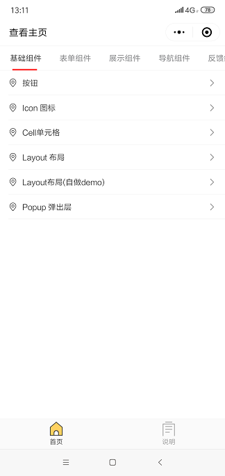
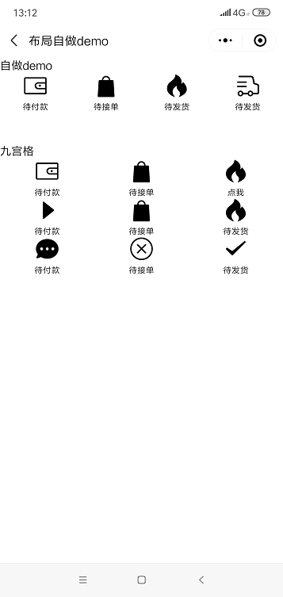
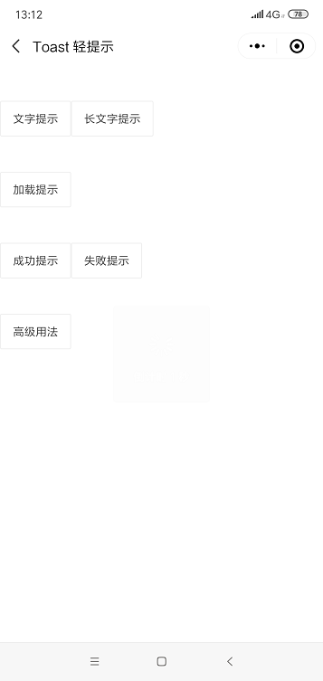

**mpvue中使用Vant Weapp**  

Vant Weapp组件库官方示例改写到Mpvue框架下   
https://github.com/aierong/vantweappmpvuedemo  


​     


**可以手机微信扫描体验一下:** 


``` 


使用步骤:
1.从Vant Weapp官网github克隆一份代码下来
https://github.com/youzan/vant-weapp 


2.把克隆代码的dist目录下的所有文件复制到我们自己项目的/static/vant/目录下
这里注意,好像一定要是这个目录 static/vant


3.在需要引入的页面目录下的main.json文件中
{ 
  "usingComponents": {
      "van-button": "/static/vant/button/index",
      "van-cell": "/static/vant/cell/index",
      "van-cell-group": "/static/vant/cell-group/index"
  }
}


4.使用
<van-button>测试</van-button>


参考:
https://github.com/Rychou/mpvue-vant
Vant Weapp官网:
https://youzan.github.io/vant-weapp 


 

```

   

**功能预览:**   




  *****************************************************




  



